# TODO
* Doplit obrázky
* Doplnit seznamy potřebných dílů a nástrojů ke každému kroku

V tomto dokumentu je uveden návod na sestavení mechanických dílů vozítka TrackJet. Část mechanických dílů je vyrobena technologií 3D tisku, část je vyřezána z překližky a plexiskla pomocí laseru. Ostatní součástky jsou běžně dostupný spojovací materiál. Dále je vsazena deska plošných spojů (DPS), kterou se zabývá samostatný návod.

___
# Obsah
* [Příprava překližkových dílů](#preklizka)
* [Sestavení krabice](#krabice1)
* [Přední stěna dveří](#dvere1)
* [Zadní stěna dveří](#dvere2)
* [Kódová kola](#kola1)
* [Mechanismus zámku](#zamek)
* [Sestavení dveří](#dvere3)
* [Nasazení kódových kol](#kola2)
* [Úchyt zadní stěny dveří](#dvere4)
* [Kontrola funkčnosti mechanismu](#kontrola)
* [Kompletace zadní stěny dveří](#dvere5)
* [Kompletace dveří](#dvere6)
* [Kompletace trezoru](#komplet)
___

## <a name = preklizka>Příprava překližkových dílů</a>
**Potřebné díly:**
* všechny díly z překližky

**Nástroje:**
* smirek

**Postup:**
1. Obruste smirkem všechny nedořezky.
    

## <a name = krabice1>Sestavení krabice</a>
**Potřebné díly:**

**Nástroje:**
* lepidlo Herkules
* papírová lepicí páska

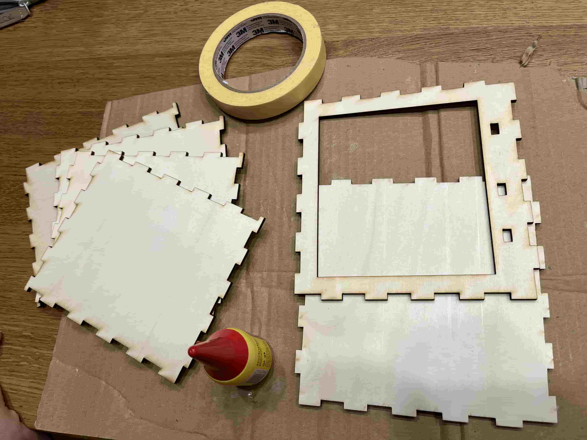

**Důležité**
* Je potřeba, aby loga firem na spodní straně krabice směřovaly dovnitř krabice!

**Postup:**
1. Složte si nachystané díly "nasucho" bez lepidla podle obrázku.
    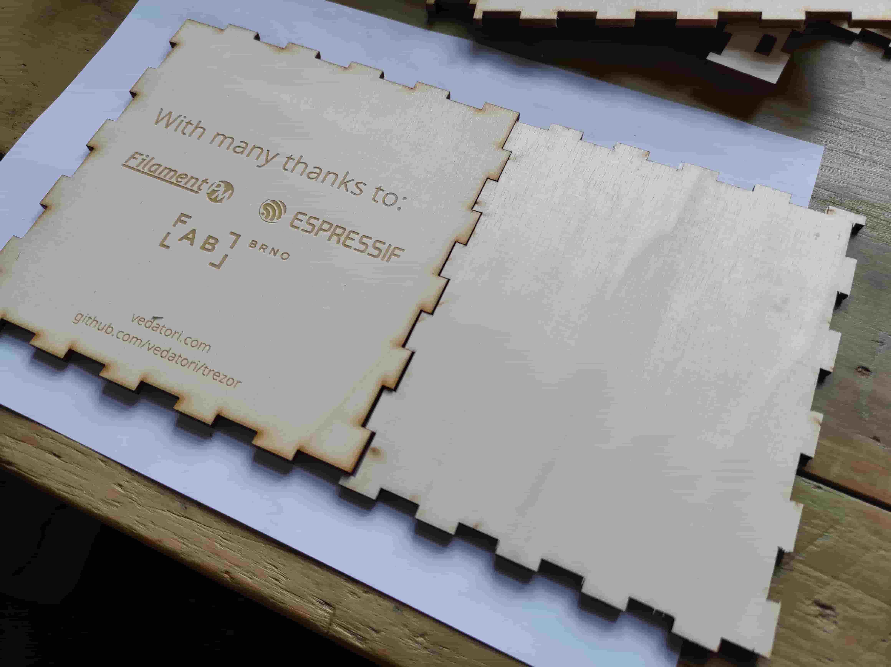
1. Pro slepení 2 dílů naneste lepidlo na 1 z nich podle obrázku. 
    
1. Vždy zajistěte spoj dvěma kousky papírové lepicí pásky.
    
1. Opakujte předchozí 2 kroky až slepíte krabici bez přední plochy podle obrázku.
    
1. Nalepte přední stěnu tak, aby její orientace vůči zadní stěně odpovídala obrázku.
    
1. Zajistěte přední stěnu lepicí páskou.
    

## <a name = dvere1>Přední stěna dveří</a>
**Potřebné díly:**
* Přední stěna dveří (ta s číselníkem)
* Vnější osa
* Vnitřní osa

**Nástroje:**
* Zalamovací nůž
* Lepidlo Chemopren

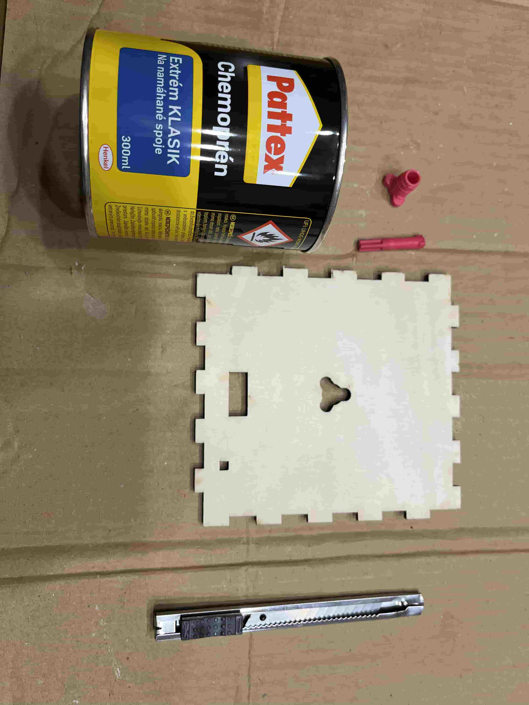

**Postup:**
1. Zařízněte nožem kulatý otvor vnější osy.
    
1. Vyzkoušejte, že je možné zasunout vnitřní osu do vnější osy.
    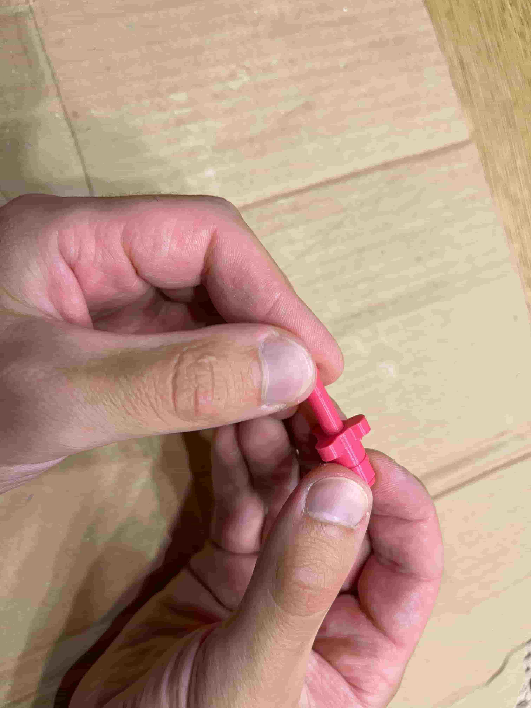
1. Naneste Chemopren na vnější osu.
    
1. Vsuňte vnější osu do přední stěny dveří a zarovnej s pogravírovanou stěnou.
    
1. Nechte zaschnout.

## <a name = dvere2>Zadní stěna dveří</a>
**Potřebné díly:**
* Zadní stěna dveří (ta s logem Vědátoři)
* Ozubené kolo se třemi výstupky

**Nástroje:**
* lepidlo Chemoprén

**Postup:**
1. Položte si zadní stěnu dveří tak, aby nebylo vidět logo, a otočte ho menší obdélníkovou dírou dolu (směrem k vám).
    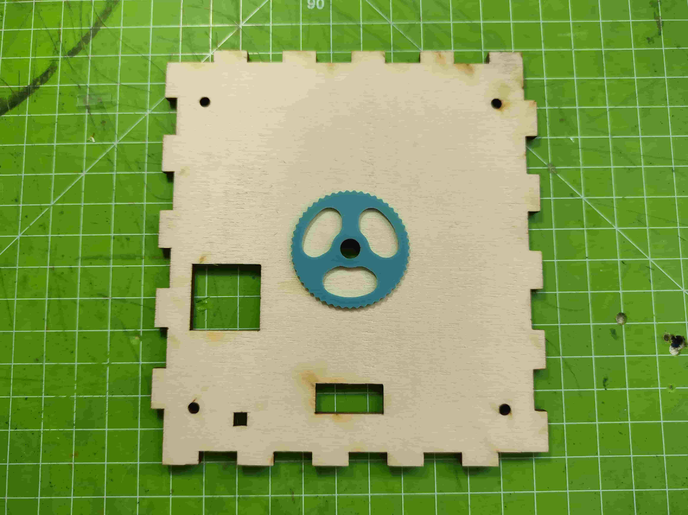
1. Naneste chemoprén na ozubené kolo dle obrázku.
     
1. Vsuňte ozubené kolo do dveří tak, aby šipka směřovala nahoru (viz obrázek). Zasuňte, co nejdál to jde.
    

## <a name = kola1>Kódová kola</a>
**Potřebné díly:**
* 3 kódová kola
* 3 cvočky (malé tmavě modré dílky)
* 4 piny

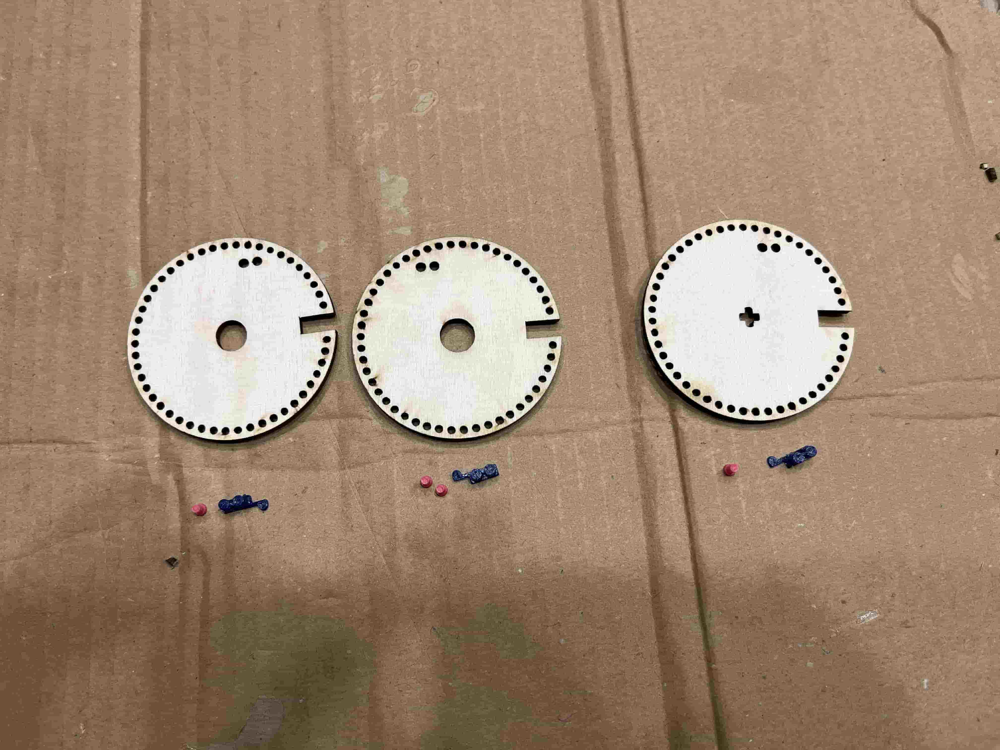

**Postup:**
1. Zvolte si váš kód pro otevření trezoru.
1. Jeden pin vložte do 1. kódového kola ze strany, kde není nápis.
    
1. Druhý pin vložte do 2. kódového kola ze strany, kde je nápis.
    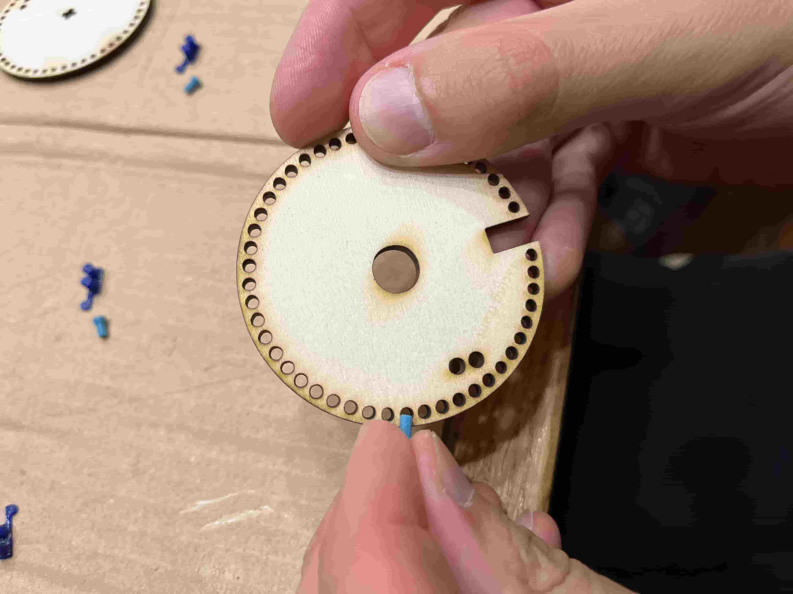
1. Třetí pin vložte do 2. kódového kola ze strany, kde není nípis.
    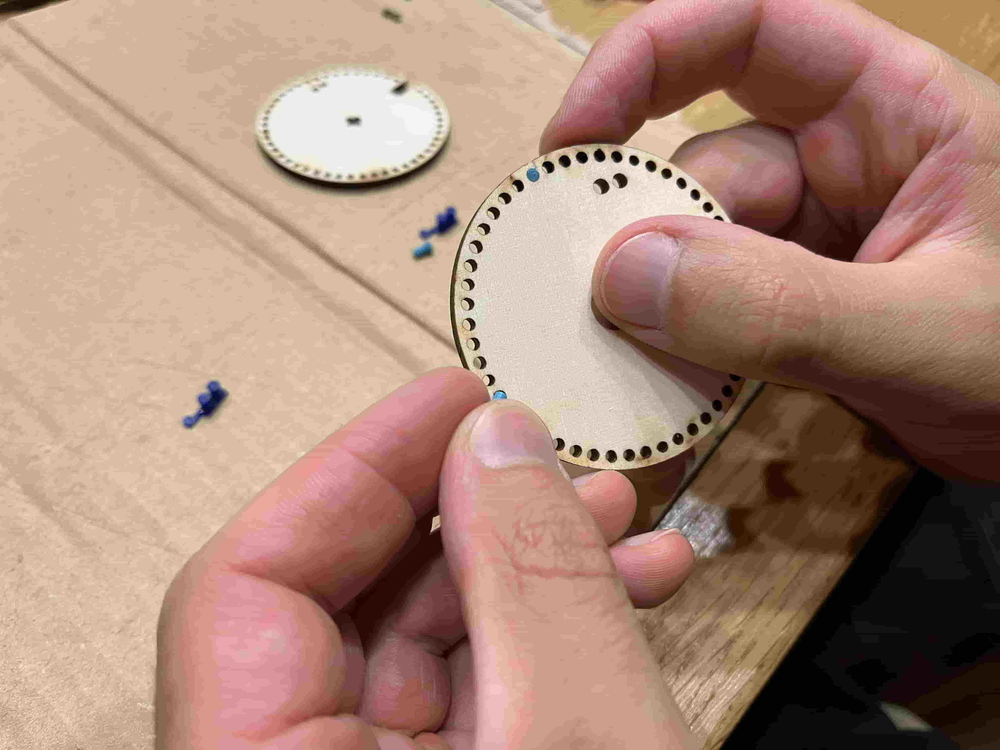
1. Čtvrtý pin vložte do 3. kódového kola ze strany, kde je nápis.
    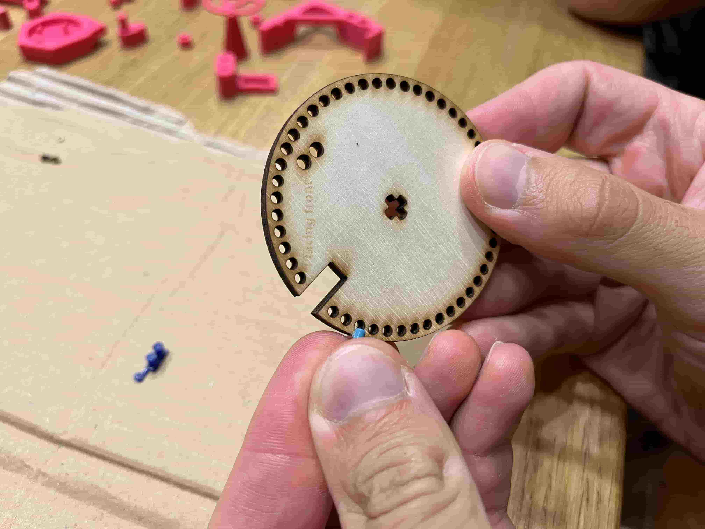
1. Vložte cvočky do každého z 3 kol. Vkládají se zobáčkem směrem do středu kola.
    

## <a name = zamek>Mechanismus zámku</a>
**Potřebné díly:**
* Přední stěna dveří (ta s číselníkem)
* Ozubené kolo s největší dírou

**Nástroje**
* Chemoprén

**Postup:**
* Položte si přední stěnu dveří naplocho obdélníkovou dírou dolů (směrem k vám).
    
* Naneste chemopren na stranu ozubeného kola s šipkou.
    
* Nasuňte ozubené kolo na vnější osu <b>tak, aby šipka míříla nahoru (od vás)</b>, přítiskněte lepidlem k přední stěně šipkou nahoru.
    
* Tiskněte uzubené kolo 10 minut, než lepidlo zaschne.
    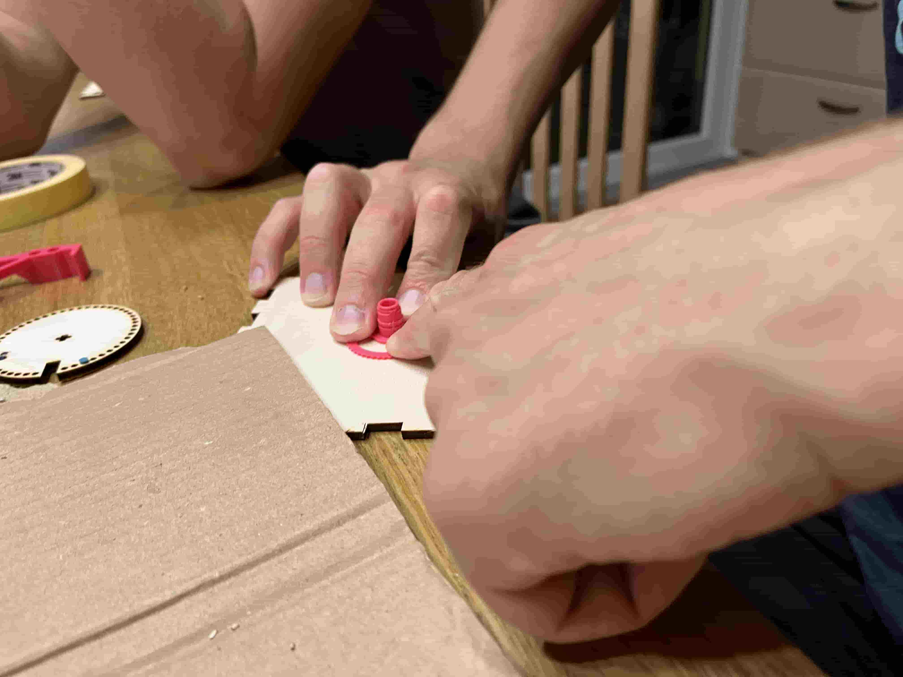

## <a name = dvere3>Sestavení dveří</a>
**Potřebné díly:**
* Přední strana dveří (ta s číselníkem)
* Boční strany dveří (4 ks)
* Zadní stěna dveří (ta s logem Vědátoři)

**Nástroje:**
* papírová lepicí páska
* lepidlo Herkules

**Důležité**
* <b>Bočnice dveří lepte orientované podle obrázku!</b>.
    Pokud si nejste jisti, raději se před zalepením poraďte s některým z vedoucích.
    

**Postup:**
1. Nalepte všechny čtyři stěny.
1. Zajistěte každý spoj kouskem papírové lepicí pásky.
    
1. <b>NELEPTE</b> zadní stěnu dveří, pouze ji "nasucho" vložte.
    

## <a name = kola2>Nasazení kódových kol</a>
**Potřebné díly:**
* Přední část dveří
* 3 Kódová kola
* Větší i menší ségrovka ("nekompletní kružnice")
* Poslední ozubené kolo

**Postup:**
1. Nasaďte první kódové kolo na vnější osu zámku tak, aby nebyl vidět nápis.
    
1. Nasaďte segrovkou do výřezu na vnější osu tak, že ji naplocho na kódové kolo mezerou směrem k vnější ose a zatlačíte na ni.
    
1. Nasaďte druhé kódové kolo na vnější osu zámku tak, aby nebyl vidět nápis.
    
1. "Nasucho" bez lepidla ozubené kolo šipkou nahoru tak, aby byla vidět.
    
1. Nasaďte menší segrovku na vnější osu.
    

## <a name = dvere4>Úchyt zadní stěny dveří</a>
**Potřebné díly:**
* Přední část dveří
* 3 Panty s dírou
* 2 díly pro úchyt zadních dveří

**Nástroje**
* Chemoprén

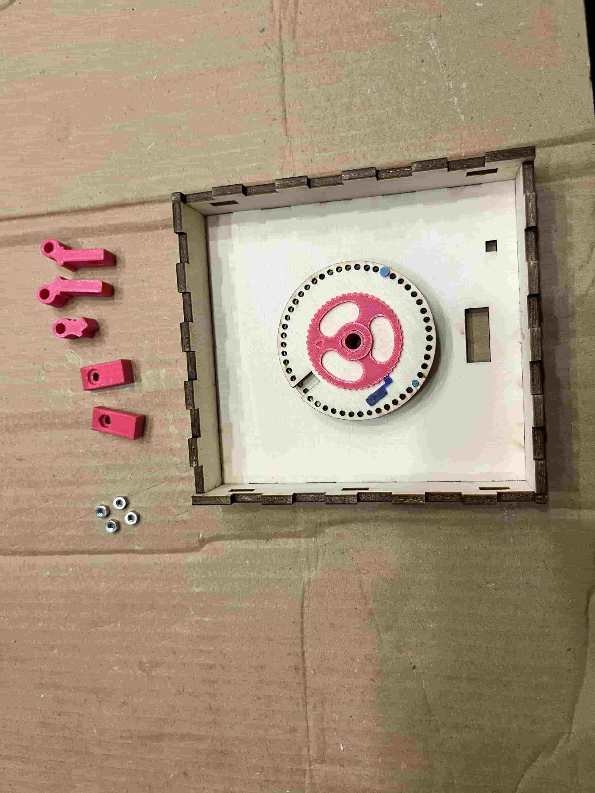

**Postup:**
1. Vsaďte matice do 4 úchytů zadní stěny dveří a z boku je zajistěte <b>malým množstvím</b> chemoprénu (nesmíte zalepit závity matic).
    
1. Naneste lepidlo na úchyty zadní stěny dveří.
    
1. Ze strany dveří s 2 obdélníkovými otvory vsadíme a zalepíme držáky bez pantů tak, aby matka mířila dolů.
    Ze strany dveří s 3 obdélníkovými otvory vsadíme a zalepíme držáky s pantem tak, aby matka mířila dolů.
    

## <a name = kontrola>Kontrola funkčnosti mechanismu</a>
**Potřebné díly:**
* Složená přední část dveří
* Kódové kolo číslo 3
* Vnitrní osa
* Adaptér na volič
* Volič
* Pojistný kroužek

**Nástroje:**
* Chemoprén

**Postup:**
1. Vsadíme vnitřní osu do dveří zvenku.
    
1. Nasadíme adaptér na konec vnitřní osy.
    
1. Nasaďte "nasucho" bez lepidla 3. kódové kolo na vnitřní osu tak, aby nebyl vidět nápis.
    
1. Nasaďte pojistný kroužek na vnitřní osu.
    
1. Otočto 3. kódové kolo tak, aby výřez mířil ke stěňě s 2 držáky.
    
1. Nasaďte "nasucho" bez lepidla volič odemykacího kódu tak, aby ručička mířila na poslední číslo odemykací kombinace. (Např. pro kombinaci 40-8-17 nastavte na 17).
    
1. Zkuste poprvé odemknout zámek trezoru podle návodu na dveřích a ověřte, že po zadání odemykacího kódu se výřezy v kódových kolech dostanou do zákrytu.
    
1. Pokud vám 1. kódové kolo nechytá 2., pin číslo 4 (viditelný zezadu) vtlačte šroubovákem více dovnitř. Znovu vyzkoušejte funkci zámku.
    
1. Pokud zámek funguje správně, naneste chemopren na díru, kam patří pin číslo 4 (viditelný). Pokud ne, konzultujte s vedoucím.
    
1. Sejměte pojistný kroužek.
    

## <a name = dvere5>Kompletace zadní stěny dveří</a>
**Potřebné díly:**
* 2x matice M3
* 2x šrouby M3x25
* 1x šroub M3x10
* (Vnitřní) Petlice
* (Vnější) Západka
* Zadní část otevíracího madla

**Postup:**
1. Očistěte zbytky filamentu v kulatých dírách v západce nožem.
    
1. Vsaďte matky M3 do petlice.
    
1. Sešroubujte západku s petlicí šrouby M3x25.
    
1. Vložte sešroubovanou západku s petlicí do zadní stěny dveří.
    
1. Provlékněte zadní stranu otevíracího madla a zajistěte M3x10 šroubem.
    

## <a name = dvere6>Kompletace dveří</a>
**Potřebné díly:**
* 4x šrouby M3x15
* 4x plastové distanční sloupky
* Dřevěný distanční sloupek
* Otevírací madlo
* Zadní pojistka otevíracího madla
* Pojistný kroužek
* Přední sestava dveří
* Zadní část dveří

**Nástroje:**
* Chemoprén

**Postup:**
1. Vsaďte distanční sloupky do otvorů na držácích dveří. Z boku zalepte malým množstvím chemoprénu.
    
1. Vsaďte dřevěný distanční sloupek gravírovanou tečkou směrem doprava.
    
1. Nastavte kódové disky do odemčené pozice, čili se zářezy v zákrytu vpravo.
    
1. Nasaďte zadní část dveří na přední část dveří.
    
1. Do otvorů v otevíracím madle naneste minimální množství chemoprénu. Nasaďte otevírací madlo. <b>Otevírací madlo se nesmí prilepit ke dveřím!</b>
    
1. Nasaďte pojistný kroužek na vnitřní osu a jemnou silou ho přitlačte.
    
1. Zašroubujte 4 šrouby M3x15 v rozích dveří.
    
1. Nekolikrát opakovaně zamčete a odemčte zámek pomocí madla a nechte jej v poloze odemčeno
    
1. Pokud jste se ujistili, že vše funguje, nalepte chemoprenem volič odemykacího kódu, tak, aby ručička mířila na poslední číslo odemykací kombinace. (Např. pro kombinaci 40-8-17 nastavte na 17).
    
    

## <a name = komplet>Kompletace trezoru</a>
**Potřebné díly:**
* Složené dveře trezoru
* Box trezoru
* 3x panty

**Nástroje:**
* Chemoprén

**Postup:**
1. Do pantů ve dveřích vložte "nasucho" bez lepidla plastové protikusy.
    
1. Naneste chemopren na otvory pantů na krabici.
    
1. Vložte panty s nasazenými dveřmi do otvorů na krabici. Zasuňte je až k ploše krabice.
    
1. Setřete vytlačené lepidlo z okolí pantů.
1. Počkejte, dokud lepidlo nezaschne (20 minut).
1. Otestujte funkce zámku trezoru.